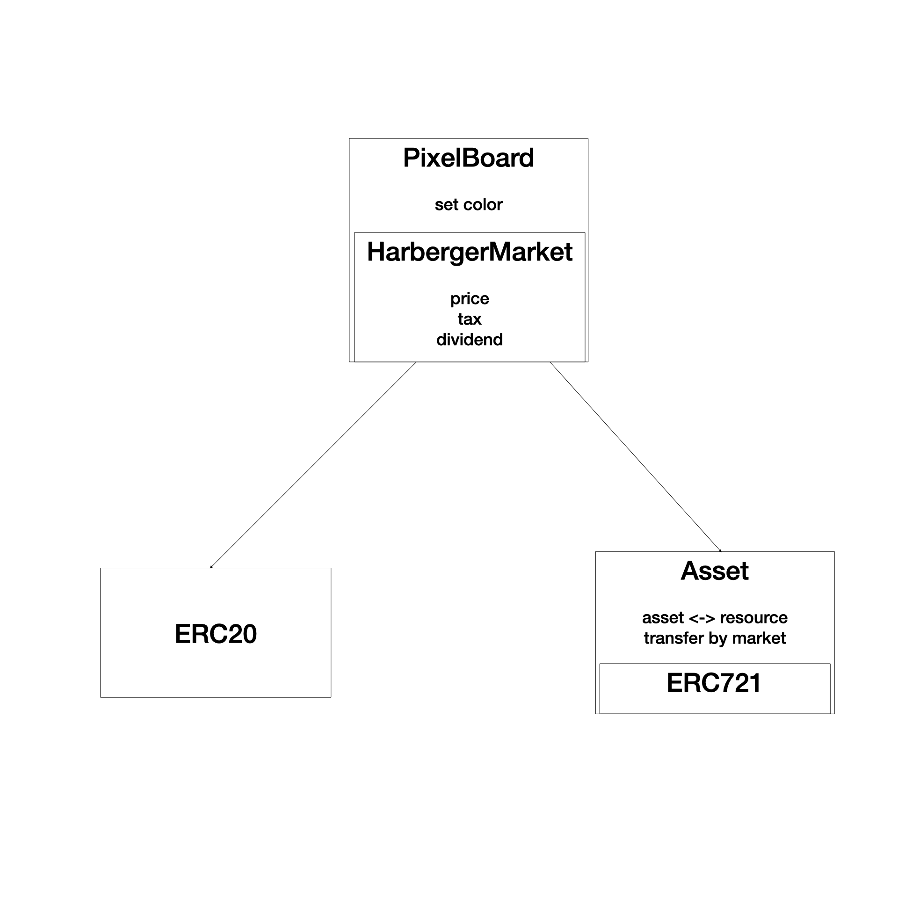

# Contracts for Matters Protocol

## The Space

_The Space_ is a pixel space owned by a decentralized autonomous organization (DAO), where members can tokenize, own, trade and color pixels. Pixels are tokenized as ERC721 tokens and traded under Harberger tax, while members receive dividend based on the share of pixels they own.

### Contract Interfaces

- [`ISpaceDAO`](./docs/TheSpace/ISpaceDAO.md): main contract of the DAO, inherit from [`IHarbergerMarket`](./docs/TheSpace/IHarbergerMarket.md) and [`IDividendDAO`](./docs/TheSpace/IDividendDAO.md).
- [`IDividendDAO`](./docs/TheSpace/IDividendDAO.md): interface of a DAO that pays dividend based on user share.
- [`IHarbergerMarket`](./docs/TheSpace/IHarbergerMarket.md): interface of a market place that trades ERC721 tokens with Harberger tax, inherit from [`IPixelCanvas`](./docs/TheSpace/IPixelCanvas.md).
  - It needs to set an ERC20 contract as currency. An ERC721 contract is set to be property, deployed by `IPixelCanvas`.
  - Users need to set approval on both ERC20 contract (currency) and ERC721 (property).
  - When cannot collect tax from currency, it removes owner and puts propety on tax sale. If property owner disapprove operation from property, re-map pixel ids to new token ids.
- [`IPixelCanvas`](./docs/TheSpace/IPixelCanvas.md): interface of a canvas on which pixels can be tokenized as ERC721 tokens and colored.
  - Keeps mappings between pixel ids and token ids.
  - Deploys a ERC721 contract among construction.
- [`ILand`](./docs/TheSpace/ILand.md): interface of a ERC721 contract representing land. It allows owners to set token URIs for their tokens, and emit events to record the URI as token content.

### Use Cases

#### Trading

- User needs to call `approve` on currency contract and `approveForAll` on `Land` contract before starting. If user disapprove while playing the game, the mapping between their tokens and pixels will be removed.
- User buy land: call [`bid` function](./docs/TheSpace/IHarbergerMarket.md) on `SpaceDAO` contract.
- User set land price: call [`price` function](./docs/TheSpace/IHarbergerMarket.md) on `SpaceDAO` contract.

#### Setting Content

- Frontend renders pixel canvas: fetch [`Colored` events](./docs/TheSpace/IPixelCanvas.md) from `SpaceDAO` contract.
- User color an array of pixels: call [`setColors` function](./docs/TheSpace/IPixelCanvas.md) on `SpaceDAO` contract.
- Frontend fetch content / metadata URI: call [`tokenURI` function](./docs/TheSpace/ILand.md) on `Land` contract.
- User set token content: call [`setTokenURI` function](./docs/TheSpace/ILand.md) on `Land` contract.

#### Tokenize

- User combine multiple token into one: call [`groupTokens` function](./docs/TheSpace/IPixelCanvas.md) on `SpaceDAO` contract.
- User seperate pixels in one token into multiple tokens: call [`ungroupToken` function](./docs/TheSpace/IPixelCanvas.md) on `SpaceDAO` contract.
