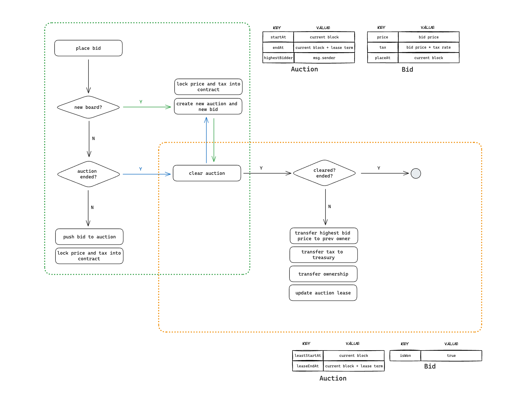
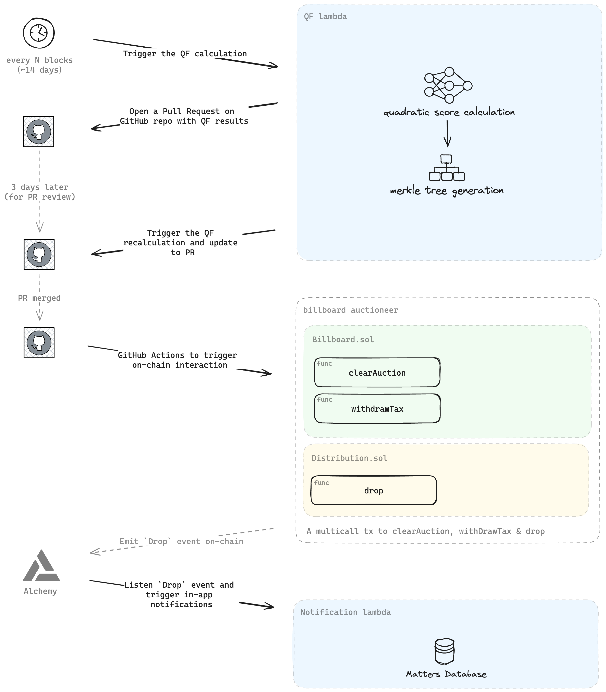

## Design

### Introduction

The on-chain billboard system transforms platform attention into NFT billboards based on Harberger tax auctions. Empowering creators with a fair share of tax revenue through quadratic voting.

### Contracts

- [IBillboard](./IBillboard.md) / [Billboard](./Billboard.md): main entrance and interface.
- [IBillboardRegistry](./IBillboardRegistry.md) / [BillboardRegistry](./BillboardRegistry.md): storage contract for Billboard.
- [IDistribution](./IDistribution.md) / [Distribution](./Distribution.md): Tax distribution contract.

## Logic flow

### Billbaord auction

See [Billboard website](https://matters.town) for more details.



### Tax distribution with QF (quadratic funding) algorithm



## Deployment

Make file is at project root.

### Preprare environment

```bash
# OP Sepolia
cp .env.op-sepolia.example .env.op-sepolia

# or OP Mainnet
cp .env.op-mainnet.example .env.op-mainnet
```

Add your keys and variables:

```bash
ETHERSCAN_API_KEY= # for contract verification
DEPLOYER_PRIVATE_KEY= # for deployment
DEPLOYER_ADDRESS= # for deployment
ETH_RPC_URL= # Alchemy API endpoint, for deployment,
CHAIN_ID= # chain id for deployment, 11155420 for OP Sepolia, 10 for OP Mainnet
BILLBOARD_ERC20_TOKEN= # ERC20 token (USDT) address for auction, tax, etc.
BILLBOARD_REGISTRY_ADDRESS= # registry contract for upgrade, leave blank for new deployment
BILLBOARD_LEASE_TERM= # in blocks
BILLBOARD_ADMIN_ADDRESS= # admin for billboard and distribution contracts
```

### Deploy to mainnet

Deploy Billboard operator and registry contracts:

```bash
make deploy-billboard NETWORK=op-mainnet
```

Deploy Distribution:

```bash
make deploy-billboard-billboard NETWORK=op-mainnet
```

## Upgrade contract

Add registry contract address to environment file:

```bash
BILLBOARD_ADMIN_ADDRESS=...
```

Deploy new operator contract:

```bash
make deploy-billboard NETWORK=op-mainnet
```

Call legacy contract and set new operator to registry:

```bash
cast send \
    {LEGACY_OPERATOR_ADDRESS} \
    "setRegistryOperator(address)" {NEW_OPERATOR_ADDRESS} \
    --private-key={ADMIN_PRIVATE_KEY} \
    --rpc-url={ALCHEMY_API_ENDPOINT}
```

## References

1. https://github.com/OpenZeppelin/merkle-tree
