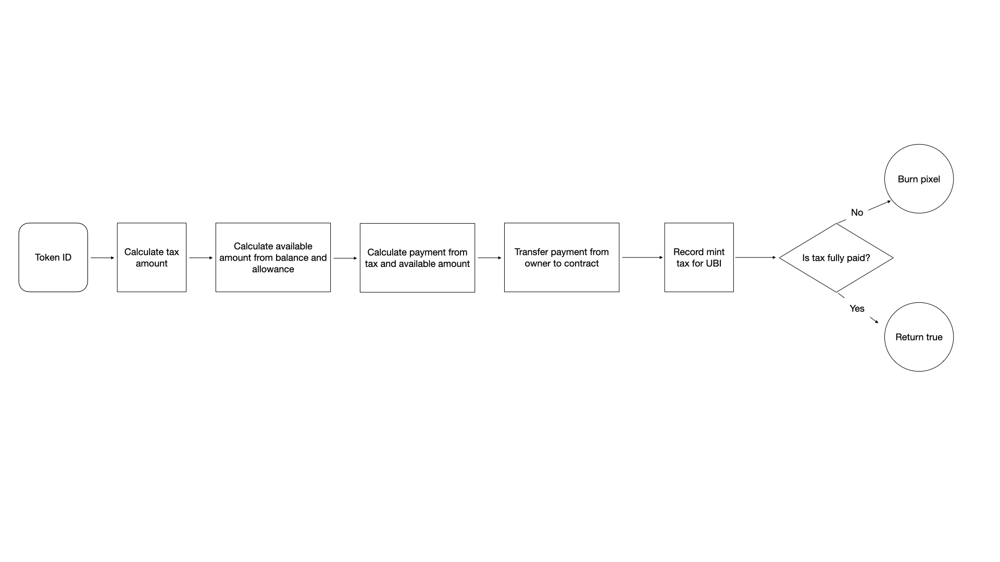
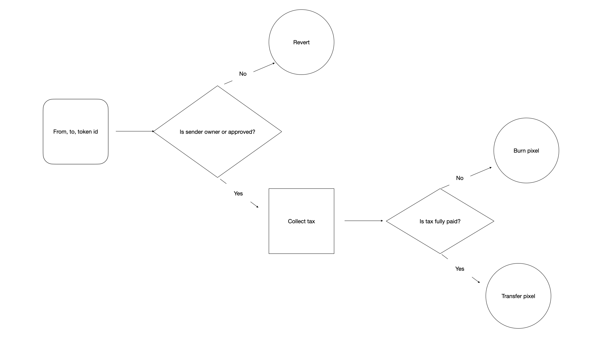
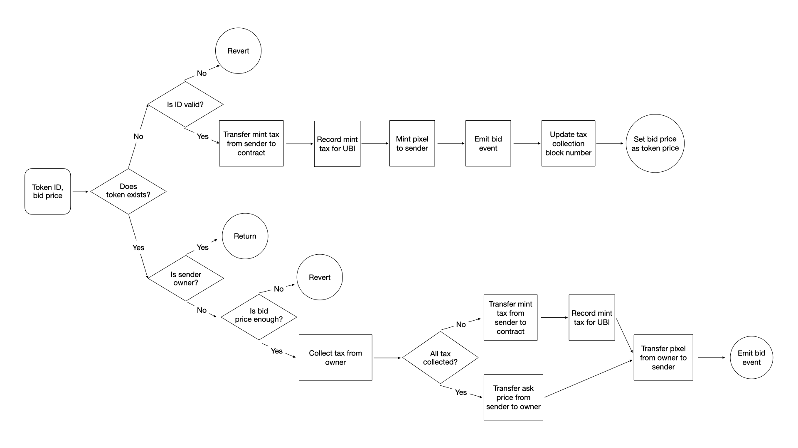

[_The Space_](https://www.thespace.game/) is a pixel board organized by Harberger Tax and UBI, where each pixel is implemented as ERC721 token.

- An explainer of the idea can be found [here](https://medium.com/coinmonks/radical-markets-can-work-on-blockchain-our-web3-experiment-the-space-shows-how-1b5d49b91d27)
- Resources on Harberger Tax, also referred to as [Partial Common Ownership](https://www.radicalxchange.org/concepts/partial-common-ownership/)

## Basic rules

- Any user can purchase any pixel with the ask price.
- User can set the price and color for the pixels s/he owns, while paying the corresponding tax.
- If an user cannot pay tax, her/his pixels are defaulted / burnt. Other users can then pay a mint fee to mint the pixel.
- Each pixel accumulates universal basic income at the same speed, which its owner can withdraw.

## Core concepts

### Tax

#### Triggering tax collection

Since smart contract itself cannot perform the equivalence of cron job, we need to trigger tax collection manually, or triggered by other user actions.

Tax collection on any pixel can be triggered by anyone at anytime via `settleTax`, and can be periodically triggered by an admistrative account of SpaceDAO.

Tax collection is also automatically triggered by the following actions:

- change price for a pixel
- transfer ownership of a pixel
- bid a pixel

#### Calculating tax

During tax collection, tax amount is calculated as:

```
{current tax rate} X {pixel price} X {number of blocks between now and last tax collection}
```

After tax is collected, it is split into two buckets, the ratio of which can be adjusted via function `setTaxConfig`:

- treasury, the bucket that is used for SpaceDAO treasury
- UBI, the total amount available to distribute to each pixel

#### Defaulting pixel

If tax cannot be fully paid during collection, the available amount is collected, and the pixel is burnt, without changing the color. Another user can mint the pixel again by bidding on it.

### Universal Basic Income (UBI)

The Space is permissionless, so any user can create an address to use it at anytime. It is therefore impossible to define "universal" based on account. Therefore, we issue UBI to each pixel at the same rate, which can be withdraw by the owner.

UBI is calculated by the total amount of tax that is allocated for UBI. Each withdraw is recorded, and future availble UBI for each pixel is caculateed as:

```
{total availble UBI for 1 pixel} - {UBI withdrawn for this pixel}
```

### Bid

Any user can bid on any pixel at anytime, by specifying a bid price.

- All minted pixel has a ask price. If the bid price is higher than or equal with the ask price, the bidder pays the owner the ask price for the pixel.
  - Before transfer, the contract will collect tax from the current owner, and default the pixel if tax is not fully collected. Then the bidder acquire the pixel as if bidding a not-yet-minted pixel.
- If the pixel is not minted yet, the bidder pays a mint tax to mint the pixel. The mint tax needs to be larger than 0 to prevent constantly defaulting and minting pixels.

For any pixel, an user can query the following information to help decide whether to bid a pixel:

- how much tax this pixel owes, and whether it will be defaulted if tax is collected, via `evaluateOwnership`
- how much UBI is available for this pixel, via `ubiAvailable`

## Logic flow for functions

### `settleTax`



### `transferFrom`



### `bid`



## Contracts

- [TheSpace](./TheSpace.md): main entrance and interface. Inherit from [HarbergerMarket](./HarbergerMarket.md), and implements pixel-specific logical such as setting and reading colors.
- [HarbergerMarket](./HarbergerMarket.md): logic for trading ERC721 tokens under Harberger Tax and issuing UBI according to the number of token owned.
- [ACLManager](./ACLManager.md): special roles that can update settings or withdraw treasury on HarbergerMarket.
- [SpaceToken](./SpaceToken.md): standard ERC20 token that can be used as currency in HarbergerMarket.
